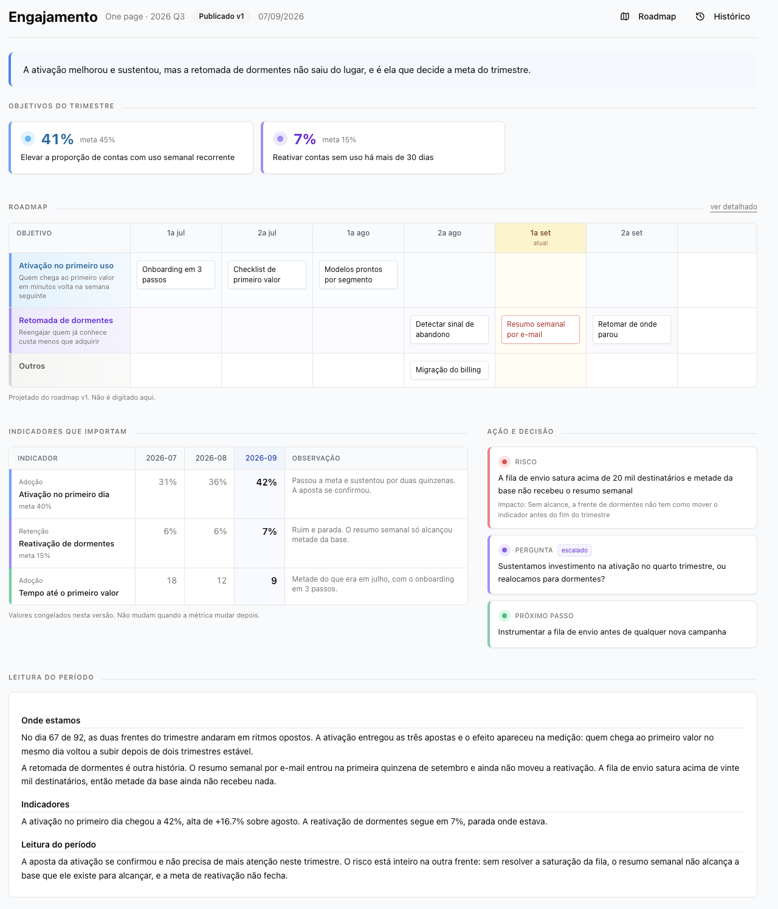

# product-skills

Skills de Claude Code que produzem os artefatos de um time de produto no padrão de uma
consultoria: o one page semanal, o deck de decisão, as release notes e qualquer texto
que saia em nome da empresa.

O método mora em um lugar só. Cada cliente ou time conecta os próprios sistemas por
cima, sem copiar nada.

## O problema

Pedir a um assistente "monta o one page do time" funciona uma vez. Na semana seguinte
sai outro documento, com outra estrutura, outro nível de detalhe e outro critério de
relevância. O padrão existia, mas morava na cabeça de quem pediu, e por isso não
sobreviveu à segunda tentativa.

O mesmo vale para deck, release notes e comunicado: a qualidade não é falta de talento
do modelo, é falta de régua. Este repositório é a régua, escrita uma vez e aplicada
sempre.

## O que sai do outro lado



Isso é a saída de `rumbo-one-page`, publicada e versionada. Vale reparar em quatro
decisões de método que a imagem mostra:

- **O insight vem antes de qualquer número.** A primeira linha diz o que aconteceu e o
  que está em jogo. Quem lê só ela já sabe do que se trata.
- **A grade do roadmap é projetada, não digitada.** Ela vem do artefato de roadmap que
  o documento aponta, então não diverge da fonte na semana seguinte.
- **Os valores ficam congelados na versão.** O que a v1 dizia continua dizendo, mesmo
  depois que a métrica mudar. É o que permite comparar semanas.
- **Ação e decisão é obrigatória.** Risco com impacto declarado, pergunta com
  destinatário nomeado, próximo passo. Se essa seção está vazia, o que existe é um
  relatório, e o método reprova.

### As quatro skills

| Skill | Dispara quando pedem | Produz |
|---|---|---|
| `rumbo-one-page` | one page, status do squad, "o que mudou essa semana", pauta do 1:1 | one page e roadmap publicados, em rascunho antes de publicar |
| `rumbo-deck` | apresentação, slides, deck, pptx, one-pager | `.pptx` em padrão de consultoria, com storyline de títulos de ação e infográficos desenhados |
| `rumbo-release-notes` | release notes, novidades da semana, "o que mudou no produto" | PDF para público não técnico, a partir dos commits da janela |
| `rumbo-escrita` | revisar texto, "tirar cara de IA", "ver se está no padrão" | o texto reescrito, com a regra que justifica cada mudança |

## Por que o resultado é constante

**O critério é arquivo, não instrução solta.** `metodo/_principios.md` vale para todo
entregável, e cada método tem o seu. Melhorar o padrão é editar um arquivo, e a
melhoria vale para todas as skills na mesma hora.

**Onde a regra é verificável, ela roda.** O QA do deck extrai o texto do PDF renderizado
e reprova o build se achar travessão, pontuação em série ou vocabulário de consultoria
genérica. A régua do one page reprova envelope com decisão sem responsável, pergunta sem
destinatário, número digitado à mão no lugar do valor apurado, ou tabela escrita em
markdown onde deveria vir dos dados.

**O que a máquina não vê vai para você, nomeado.** Colisão de layout, se o argumento
fecha, se o insight é mesmo o essencial. A skill manda olhar e nunca reporta como
conferido o que não foi conferido.

**Nada sai sozinho.** Publicar é sempre duas etapas, rascunho e publicação, e nenhuma
skill manda para Slack, e-mail ou página compartilhada sem confirmação explícita.

## Como instalar

```
/plugin marketplace add Rumbo-Builders/product-skills
/plugin install rumbo-core@rumbo
```

Depois é conversa normal. As skills disparam pelo que você escreve, sem comando:

> monta o one page do time de engajamento dessa semana
>
> revisa esse e-mail antes de eu mandar pro board
>
> quais foram as novidades do produto entre 27/08 e hoje

Sem binding de cliente, a skill pergunta de onde ler e onde escrever antes de começar.
Ela não assume ferramenta.

**O que precisa estar na máquina:** `pptxgenjs` para o deck, LibreOffice e poppler para
renderizar e conferir o `.pptx`, Chrome ou Chromium para o PDF das release notes. Sem
essas ferramentas os scripts avisam e param, e o que não foi conferido é reportado como
não conferido.

## Como derivar para o seu time

A skill de método é cliente-agnóstica de propósito: ela não conhece ferramenta, ID nem
nome de pessoa. Quem conhece é a skill derivada, que você escreve no plugin do seu time.

Uma derivada tem cinco seções e cabe em trinta linhas:

```markdown
---
name: one-page-engajamento
description: >-
  Use quando pedirem o one page do time de Engajamento, o status semanal do
  engajamento, ou a pauta do 1:1 do time.
---

## ENTRADAS
Dossiê do time `engajamento` na API interna. Métricas manuais entram por conversa.

## SAÍDAS
Rascunho no espaço de produto. Publicação só depois do meu ok.

## DESVIOS
Aqui "dormentes" são contas sem uso há mais de 30 dias, não 60.

## DELEGAÇÃO
Carregue a skill `rumbo-one-page` e execute o fluxo dela com este binding.
Onde o método conflitar com este arquivo, este arquivo vence.
```

Três coisas que fazem isso funcionar:

1. **A derivada delega pelo nome, nunca por caminho de arquivo.** Plugin instalado só
   enxerga o próprio diretório, então `plugins/rumbo-core/...` não existe na máquina de
   quem instalou.
2. **Fato do time mora no `contexto/perfil.md`**, uma vez só. Stakeholders, cadência,
   vocabulário e tom são lidos por todas as skills daquele time.
3. **Se a derivada passou de trinta linhas, ela está fazendo o trabalho de outro
   arquivo.** Ou virou método, e sobe generalizada, ou virou contexto, e desce para o
   perfil. `templates/plugin-cliente/` é o esqueleto para copiar, e as convenções estão
   em [CLAUDE.md](CLAUDE.md).

## Onde ficam os clientes

**Não aqui.** Cada cliente tem o próprio repositório de plugins, na organização dele, no
formato `<cliente>-claude-plugins`. Três motivos, e o primeiro sozinho já decide:

1. **Isolamento por construção.** Quem está na org de um cliente não tem acesso à do
   outro. Não é uma regra a manter, é uma parede que já existe.
2. **Este repositório é público.** O método é cliente-agnóstico por regra, então
   publicá-lo não expõe ninguém. Perfil de cliente, sim. Um CI reprova qualquer commit
   que nomeie um cliente.
3. **A skill deixa de ser refém de um repositório.** Instalada como plugin na org do
   cliente, ela vale em qualquer sessão daquele time.

Quem usa instala dois marketplaces: este, com o método, e o da própria empresa, com o
binding. Sem o `rumbo-core` instalado, a derivada não tem para onde delegar.

## Mapa

```
plugins/rumbo-core/
  metodo/          a PI: princípios, escrita, deck, release notes, one page
  skills/          o fluxo de cada conversa, e os scripts que rodam
templates/         esqueletos para copiar: método novo, skill nova, plugin de cliente
CLAUDE.md          convenções de autoria, e como rodar cada script
```

Divisão de trabalho: `metodo/` é o que se lê, `scripts/` é o que roda, `SKILL.md` é o
que conduz.

## Estado

Quatro métodos escritos e as skills genéricas correspondentes. Nenhum binding de cliente
mora aqui, e nenhum jamais morou: eles saíram antes do primeiro commit, de propósito. O
que entra no histórico do git não sai mais.

Dívida conhecida: o `templates/plugin-cliente/contexto/perfil.md` ainda pede campos que
não deveriam entrar num plugin, como quem não pode ser copiado e escopo comercial. A
régua correta é simples, se o cliente não pode ler, não entra. O template precisa ser
corrigido antes de servir ao próximo cliente.
